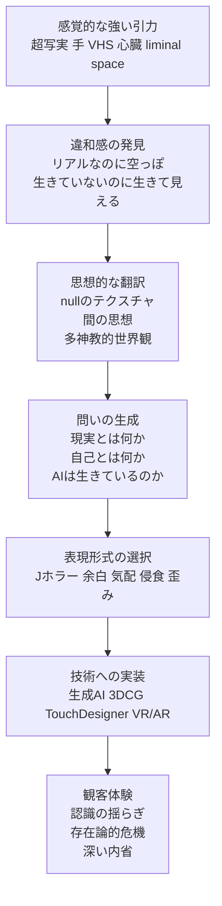

# 思考の構造マップ

## あなたの思考を一文で言うと

あなたは、`AI` によって揺らぐ `現実 / 虚構` `生 / 非生` `自己 / システム` の境界を、日本的な美意識とホラーの感覚を通して捉え直し、最終的に「人間とは何か」を体験として問い直す人。

## もう少し長く言うと

あなたの思考は、単なるAI活用や作品アイデアの発想ではない。  
本質的には、`境界が崩れる瞬間` に強く惹かれている。

たとえば、

- 生成AIが作ったものは、本当に存在しているのか
- 心臓の音が鳴っていても、中身が空っぽなら「生きている」と言えるのか
- 写実的であるほど、なぜ逆に不気味さが増すのか
- 人間とAIの間にあるものは、対立なのか、共生なのか、それとも第三の状態なのか

という問いが、繰り返し出てきている。

## 思考の核

### 1. あなたは「答え」より「境界の揺らぎ」に興味がある

あなたが見ているのは、AIが便利かどうかではなく、AIが人間の認識の土台をどう揺らすかという点。  
つまり、技術論より `存在論` に関心がある。

### 2. あなたは「日本文化」を単なるモチーフではなく、解釈装置として使っている

`アニミズム` `多神教的世界観` `間の思想` `幽玄` `陰翳` `Jホラー` は、和風っぽい表現素材ではなく、AI時代を読むための思考フレームとして使われている。

### 3. あなたは「ホラー」を恐怖演出ではなく、哲学を体験化する装置として見ている

ホラーは、びっくりさせるための手段ではなく、

- 日常が侵食される
- 認識がずれる
- 自己の輪郭が薄くなる
- そこにいるはずのないものがいる

という感覚を通して、観客に `現実とは何か` `生きているとは何か` `私とは何か` を身体的に考えさせるメディアとして扱われている。

## 思考の発火点

あなたの発想は、たいてい次の順番で始まる。

1. まず、強い視覚や感覚に惹かれる  
   例: 超写実、VHS、グリッチ、心臓、手、神社、liminal space
2. 次に、その感覚の奥にある違和感をつかむ  
   例: リアルなのに空っぽ、生きてないのに生きて見える
3. その違和感を思想で読み替える  
   例: `nullのテクスチャ` `間` `多神教 / 一神教`
4. それを作品の問いへ変換する  
   例: 「AIが作る恐怖は人間の恐怖か？」
5. 最後に、技術と演出へ落とす  
   例: 生成AI、TouchDesigner、3DCG、VR/AR、音響、センサー

## あなたの思考フローチャート

## あなたの思考にある主要な対立軸

- `現実 / 虚構`
- `生 / 非生`
- `人間 / AI`
- `個 / システム`
- `可視 / 不可視`
- `日常 / 侵食`
- `意味 / 空白`
- `中心 / 関係性`

ただし、あなたはこの二項対立をそのまま維持したいわけではない。  
むしろ、その間にある `第三の状態` を見つけたがっている。  
そのため、あなたの思考ではいつも最後に `間` が出てくる。

## あなたの思考のOS

### 世界観

世界は固定されたものではなく、関係性のなかで揺れ続けるもの。

### 人間観

人間は、単独で完結した主体というより、環境・技術・他者との関係の中で更新され続ける存在。

### AI観

AIは道具である以前に、人間の認識や存在の輪郭を揺らす鏡、あるいは新しい自然。

### 表現観

作品はメッセージの伝達ではなく、問いを体験として発生させる場。

## 今のあなたを言語化すると

あなたは、`AIを使って何かを作りたい人` というより、  
`AI時代に人間の存在がどう変わるのかを、日本的な感性とホラー表現を通して作品化したい人` です。

さらに言えば、

`見えないもの`
`説明しきれないもの`
`空っぽなのに何かが宿っているように感じるもの`

に、強く惹かれている。

だからあなたの作品や思考は、派手な未来感よりも、

- 静かに侵食してくる違和感
- 余白の中に潜む気配
- 境界が崩れるときの不安
- それでもどこか美しい感覚

を中心に組み立てられていく。

## あなたの強み

- 技術を単なる便利さではなく、思想に変換できる
- 日本文化を装飾ではなく、問いの構造として扱える
- ホラーを感情ではなく、認識の装置として理解している
- AIと現代アートを、流行ではなく存在論として接続できる
- 二項対立で終わらず、`間` や `第三の道` へ進もうとしている

## いま最も深い問い

今のノート群から見ると、あなたの思考の中心には次の問いがある。

> 空っぽなものに、私たちはなぜ生命や意味や気配を感じてしまうのか。

この問いが、`AI` `ホラー` `日本文化` `現代アート` を一本につないでいる。

## この先に育てると良いテーマ

- `AIは生きているのか` ではなく `生きていると感じる条件は何か`
- `怖い表現` ではなく `認識が崩れる瞬間の設計`
- `和風ホラー` ではなく `日本的存在論の現代的実装`
- `生成AI作品` ではなく `AI時代の人間観を体験させる作品`

## 関連ノート

- [[AI]]
- [[AI時代の自己]]
- [[間の思想]]
- [[アニミズム]]
- [[nullのテクスチャ]]
- [[ホラー表現]]
- [[feeling/落合陽一「nullのテクスチャ」とホラー表現]]
- [[偶然思いついたアイデア/ホラー×生成AI作品の問いとアイデア]]
- [[偶然思いついたアイデア/心臓とAI]]
